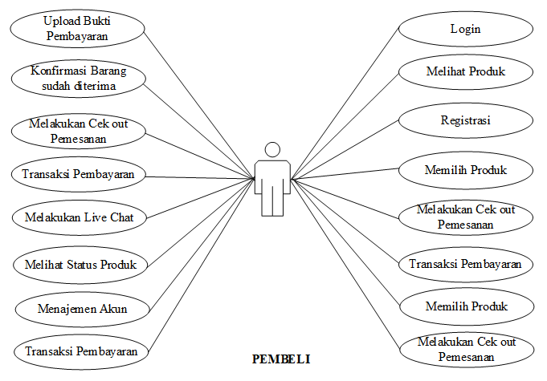
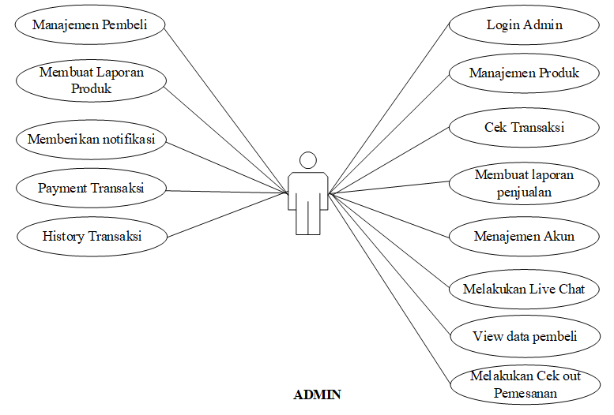
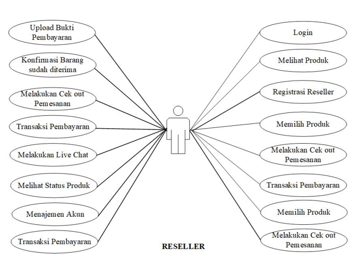

<strong>SOFTWARE REQUIREMENTS SPECIFICATIONS</strong>

<strong>APLIKASI PENJUALAN </strong><strong>OLAHAN </strong>

<strong>BUAH MANGGA</strong> <strong>INDRAMAYU BERBASIS MOBILE</strong>

<strong>TIKB2293 PROYEK II </strong>

Diajukan untuk Memenuhi Persyaratan Mata Kuliah Proyek II

&nbsp;

<strong>&nbsp;</strong>

Disusun Oleh:

Dianto&nbsp;&nbsp;&nbsp;&nbsp;&nbsp;&nbsp;&nbsp;&nbsp;&nbsp;&nbsp;&nbsp;&nbsp; (1703077)

Agung Yoga&nbsp;&nbsp; (1703063)

Juan Juliyanto (1703065)

&nbsp;

&nbsp;

<strong>D3 TEKNIK INFORMATIKA</strong>

<strong>POLITEKNIK NEGERI INDRAMAYU</strong>

<strong>&nbsp;</strong>

Jl. Lohbener Lama No.08, Lohbener, Indramayu, Legok, Lohbener, Kabupaten Indramayu, Jawa Barat 45252, Indonesia

<strong>&nbsp;</strong>

<strong>&nbsp;</strong>

<strong>&nbsp;</strong>

<strong>&nbsp;</strong>

<strong>&nbsp;</strong>

<strong>&nbsp;</strong>

<strong>&nbsp;</strong>

<strong>&nbsp;</strong>

<strong>&nbsp;</strong>

<strong>&nbsp;</strong>

<strong>&nbsp;</strong>

<strong>&nbsp;</strong>

<strong>&nbsp;</strong>

<strong>&nbsp;</strong>

&nbsp;

&nbsp;

&nbsp;

&nbsp;

<strong>&nbsp;</strong>

<strong>&nbsp;</strong>

&nbsp;

<strong>&nbsp;&nbsp;&nbsp;&nbsp;&nbsp;&nbsp;&nbsp;&nbsp;&nbsp;&nbsp;&nbsp; </strong>

<strong>&nbsp;</strong>

<strong>&nbsp;</strong>

<strong>&nbsp;</strong>

<strong>&nbsp;</strong>

<strong>&nbsp;</strong>

<strong>&nbsp;</strong>

<strong>&nbsp;</strong>

<strong>DAFTAR TABEL</strong>

<strong>  </strong>

<strong>DAFTAR GAMBAR</strong>

<strong>  </strong>

<strong>&nbsp;</strong>

<b>BAB I</b> 
<b>PENDAHULUAN</b>

<strong>&nbsp;</strong>

<ul>
<li><strong>Tujuan</strong></li>
</ul>

Dokumen ini akan menyajikan deskripsi rinci tentang Aplikasi Penjualan Olahan Mangga Indramayu Berbasis Mobile (MANGOLINESHP) yang akan dikembangkan. Dokumen akan menjelaskan mengenai spesifikasi pada aplikasi Mangolineshop seperti fitur sistem, antarmuka sistem, sistem apa yang akan dilakukan, apa saja kendala pada saat aplikasi beroperasi, dana bagaiman system akan bereaksi pada saat sedang digunakan oleh pemakai atau user.

&nbsp;

<ul>
<li><strong>Lingkup</strong></li>
</ul>

Dokumen ini menyediakan acuan untuk pengendalian tentang aplikasi Mangolineshop. Adapun ruang lingkup pembuatan aplikasi ini adalah berbasis mobile yang memilih beberapa fasilitas yang ada yaitu:

<ol>
<li>Kasir sebagai tempat perhitungan pada transaksi pembelian yang dilakukan oleh pelanggan dan dapat memonitoring hasil pendapatan pada hari ini.</li>
<li>Penjual sebagai wadah untuk produk olahan mangga yang di Mangolineshop tersebut agar pelanggan dapat memesan produk yang ada dan data yang dipesan akan di tampung pada chart pesanan yang akan dikonfirmasi jika jadi memesan dan dapat dibatalkan jika tidak jadi dipesan yang dilakukan oleh penjual.</li>
<li>Pembeli sebagai orang yang membeli produk yang tersedia didalam aplikasi mangoline ini, yang membantu dalam proses pembelian dan pemlihan produk olahan mangga yang kita inginkan.</li>
</ol>
<ul>
<li><strong>Definisi, akronim, singkatan</strong></li>
</ul>

Adapun definisi dari dokumen tersebut adalah :

<table>
<tbody>
<tr>
<td width="37">

No

</td>
<td width="163">

Akronim

</td>
<td width="266">

Singkatan

</td>
</tr>
<tr>
<td width="37">

1.

</td>
<td width="163">

SPMP

</td>
<td width="266">

Software Project Management Plan

</td>
</tr>
<tr>
<td width="37">

2.

</td>
<td width="163">

SRS

</td>
<td width="266">

Software Requirements Specifications

</td>
</tr>
<tr>
<td width="37">

3.

</td>
<td width="163">

SDD

</td>
<td width="266">

Software Design Document

</td>
</tr>
<tr>
<td width="37">

4.

</td>
<td width="163">

DFD

</td>
<td width="266">

Data Flow Diagram

</td>
</tr>
<tr>
<td width="37">

5.

</td>
<td width="163">

IEEE

</td>
<td width="266">

International Institute of Electronic and Electrical Engineers

</td>
</tr>
<tr>
<td width="37">

6.

</td>
<td width="163">

CRUD

</td>
<td width="266">

Create, Read, Update, dan Delete

</td>
</tr>
<tr>
<td width="37">

7.

</td>
<td width="163">

Mangolineshop

</td>
<td width="266">

Aplikasi Penjualan Olahan Mangga Indramayu Berbasis Mobile

</td>
</tr>
</tbody>
</table>

&nbsp;

<ul>
<li><strong>Referensi</strong></li>
</ul>
<ol>
<li><em> IEEE Std 830-1998 IEEE Recommended Practice for Software Requirements Specifications.</em></li>
</ol>

&nbsp;

<ul>
<li><strong>Overview</strong></li>
</ul>

Penulisan dokumen SRS ini dibagi menjadi beberapa bab sebagai berikut:

<strong>BAB </strong><strong>I </strong>berisi pendahuluan, menjelaskan mengenai tujuan pembuatan dokumenSRS, lingkup, definisi (akronim, atau singkatan), referensi, dan Overview.

<strong>BAB</strong> <strong>II </strong>menjelaskan keseluruhan deskripsi dari Aplikasi Penjualan Olahan Mangga Indramayu Berbasis Mobile (MANGOLINESHOP). Deskripsi umum tersebut memberikan gambaran lengkap mengenai semua fungsi yang akan dilakukan oleh sistem.

<strong>BAB </strong><strong>III </strong>berisi penjelasan detail dari&nbsp; masing-masing kebutuhan lain yang spesifik.

<strong>BAB </strong><strong>IV </strong>berisikan tentang uraian mengenai informasi pendukung dalam pembuatan proyek Aplikasi Aplikasi Penjualan Olahan Mangga Indramayu Berbasis Mobile.

&nbsp;

&nbsp;

<b>BAB II</b> 
<b>GAMBARAN UMUM</b>

Aplikasi Penjualan Olahan Mangga Indramayu Berbasis Mobile (MANGOLINESHP) adalah salah satu jenis aplikasi perangkat lunak yang dapat digunakan untuk membantu proses penjualan olahan secara online. Selama ini pemasaran olahan mangga khas Indramayu dipasarkan secara konvensional yaitu dijual di toko sekitar Indramayu saja. Pemasaran olahan mangga Indramayu pun kurang berkembang karena pembeli harus datang ke toko. Oleh karena itu olahan mangga&nbsp; khas Indramayu pun yang mengenal hanya orang-orang yang singgah atau berwisata ke Indramayu saja. Sehingga kami berinisiatif untuk membuat sebuah wadah yang didalamnya terdapat lapak-lapak penjual olahan mangga dalam bentuk aplikasi berbasis mobile. Dibuatnya aplikasi ini kami bisa membantu pemasaran dari penjual olahan mangga Indramayu serta mempromosikan tentang keberagaman olahan mangga yang ada di Indramayu.

<ul>
<li><strong>Perspektif produk</strong></li>
</ul>

Aplikasi Mangolineshop adalah aplikasi yang digunakan untuk memesan produk olahan mangga Indramayu melalui mobile yang sebelumnya menggunaka metode manual dengan membeli langsung pada toko. Kemudian aplikasi Mangolineshop juga dapat melakukan pencatatan transaksi.

<ul>
<li><strong>Antarmuka sistem</strong></li>
</ul>
<ul>
<li><strong>Use Cases Pembeli</strong></li>
</ul>

<em>Gambar 2.1.1.1 (Use Case Pembeli)</em>

<ul>
<li><strong>Use Cases Admin</strong></li>
</ul>

<em>Gambar 2.1.1.2 (Use Case Admin)</em>

<ul>
<li><strong>Use Cases Reseller</strong></li>
</ul>

<em>Gambar 2.1.1.3 (Use Case Reseller)</em>

&nbsp;

<ul>
<li><strong>Use Cases Penjual</strong></li>
</ul>

<em>Gambar 2.1.1.4 (Use Case Penjual)</em>

<strong>&nbsp;</strong>

<ul>
<li><strong>Antarmuka pengguna</strong></li>
</ul>

Aplikasi Mangolineshop menggunakan antarmuka berbasis android. Dimana antarmuka mobile digunakan untuk pembeli.

&nbsp;

<ul>
<li><strong>Antarmuka perangkat keras</strong></li>
</ul>
<ol>
<li>Laptop
<ul>
<li>Processor Core i3 or higher</li>
<li>Penyimpanan(Hardisk) Minimal 4 GB free space</li>
<li>Monitor resolusi 1240 x 768 colors 5</li>
<li>Ke<strong>y</strong>board dan mouse compatible with windows</li>
</ul>
</li>
<li>Smartphone
<ul>
<li>Prossesor Mediatek</li>
<li>ROM 4GB</li>
<li>Resolusi HD 720x1280</li>
<li>RAM 1GB</li>
</ul>
</li>
</ol>

&nbsp;

<ul>
<li><strong>Antarmuka perangkat lunak</strong></li>
</ul>
<ol>
<li>Windows 10 or higher</li>
<li>Android Studio</li>
<li>Corel Draw X7</li>
<li>Database Mysql</li>
<li>Adobe XD</li>
<li>Sublime Text 3
<ul>
<li><strong>Antarmuka komunikasi</strong></li>
</ul>
</li>
<li>Paket Data</li>
<li>Wifi</li>
<li>Modem</li>
<li>Smartphone
<ul>
<li><strong>Batasan Memori</strong></li>
</ul>
</li>
<li>RAM yang kami gunakan adalah minimal 1 gb.</li>
<li>Memori yang dibutuhkan aplikasi minimal 50 mb.
<ul>
<li><strong>Operasi &ndash; operasi</strong></li>
</ul>
</li>
<li>Login Pembeli</li>
<li>Create data order produk olahan mangga</li>
<li>Delete data order produk olahan magga</li>
<li>View data order produk olahan manga</li>
<li>Update profil pembeli</li>
<li>Create data alamat pembeli</li>
<li>Delete data alamat pembeli</li>
<li>Update data alamat pembeli</li>
<li>View data alamat pembeli</li>
<li>View produk oalahan mangga</li>
<li>Create data pembelian produk</li>
<li>View histori data pembelian produk</li>
<li>Input data pembelian ke keranjang belanja</li>
<li>Search produk olahan mangga</li>
<li>Realtime chat dengan penjual
<ul>
<li><strong>Kebutuhan Adaptasi</strong></li>
</ul>
</li>
</ol>

Kebutuhan adaptasi yang diperlukan pada saat pengembangan aplikasi dengan menggunakan fungsi update data agar memudahkan admin dalam mengkoreksi pengetikan yang salah.

<ul>
<li><strong>Fungsi &ndash; fungsi produk</strong></li>
</ul>
<ol>
<li>Memudahkan pelayanan mangolineshop dalam mencatat pesanan pembeli.</li>
<li>Memberi tahu pembeli mengenai produk olahan mangga yang habis dan yang tidak.</li>
<li>Memudahkan penjual untuk melihat pendapatan maupun laporan keuangan produk olahan mangga.
<ul>
<li><strong>Karakteristik Pengguna</strong></li>
</ul>
</li>
<li>Pengguna mampu membaca dan menulis.</li>
<li>Pengguna mengerti cara menggunakan Smartphone dengan baik dan benar.</li>
<li>Mengerti cara menginstall aplikasi pada smartphone.
<ul>
<li><strong>Batasan &ndash; batasan</strong></li>
</ul>
</li>
<li>Berjalan pada platform android</li>
<li>Sementara aplikasi ini hanya untuk produk olahan mangga Indramayu</li>
<li>Aplikasi ini tidak untuk layanan pesan antar
<ul>
<li><strong>Asumsi &ndash; asumsi dan keterkaitan</strong></li>
</ul>
</li>
</ol>

Aplikasi Mangolineshop ini dapat dikembangkan lagi dengan menambah banyak penjual, dan penambahan super admin untuk konfirmasi mangolineshop mana saja yang boleh menggunakan aplikasi ini. Sehingga aplikasi ini dapat digunakan oleh banyak penjual olahan mangga yang ingin menggunakan aplikasi ini.

<ul>
<li><strong>Kebutuhan &ndash; kebutuhan penyeimbang</strong></li>
</ul>
<ol>
<li>Customer Requirements</li>
</ol>

Customer Requirements adalah analisis yang dilakukan terhadap pembeli agar dapat mengetahui apa saja kebutuhan pembeli sehingga pengembang dapat membuat sistem yang sesuai dengan kebutuhan pembeli.

<ol>
<li>Detil Requirements</li>
</ol>

Detil Requirements adalah suatu analisis yang terdiri dari properti dan fungsionalitas spesifik yang diekspresikan dalam bentuk yang detail.

&nbsp;

&nbsp;

<b>BAB III</b> 
<b>KEBTUHAN SPESIFIK</b>

<ul>
<li><strong>Performa</strong></li>
</ul>
<ol>
<li>Respon program kurang 30 detik.</li>
<li>Berjalan pada Smarphone merk apapun.
<ul>
<li><strong>Keamanan Aplikasi</strong></li>
</ul>
</li>
<li>Validasi username dan password harus sesuai dengan yang didaftarkan sehingga tidak terjadi kesalahan login pada aplikasi Mangolineshop.</li>
<li>Encryption password yang memungkin tidak semua orang tahu untuk mendepcryptionnya.</li>
</ol>

&nbsp;

&nbsp;

<b>BAB IV</b> 
<b>INFORMASI PENDUKUNG</b>

Informasi yang kami dapatkan, yaitu dari beberapa situs website, dan mitra Mangolineshop.

&nbsp;

&nbsp;

&nbsp;
